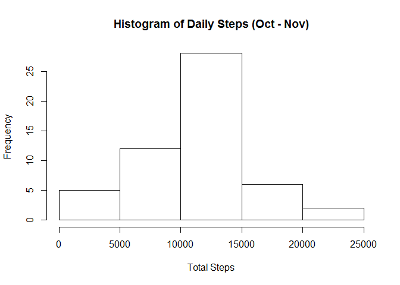
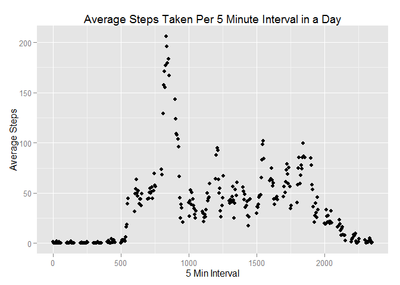
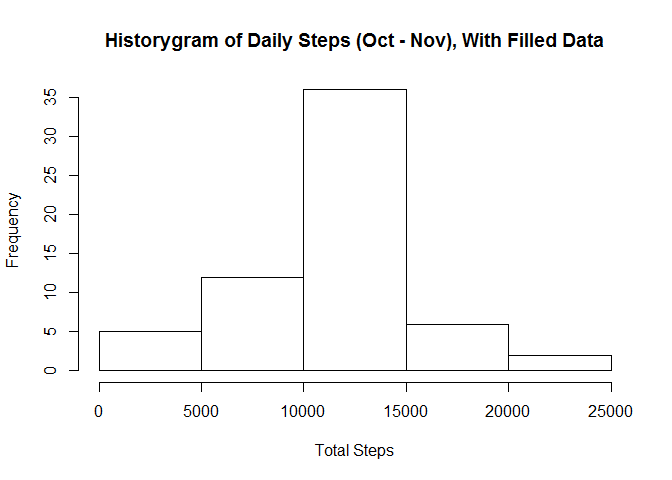
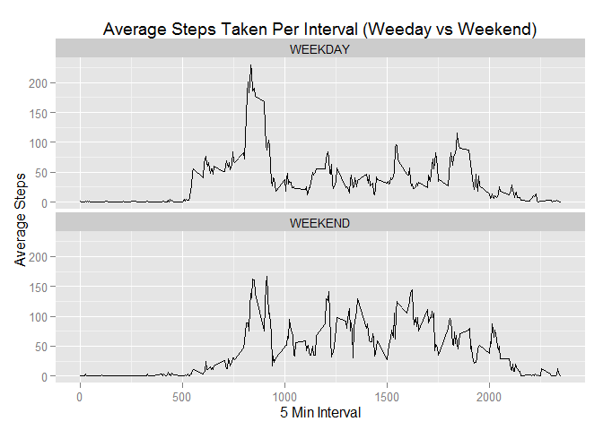

# Project1
L Katz  
January 10, 2016  

This project aims to evaluate the activity dataset provided for the class. This analysis requires the "activity.csv" file to be in your working directory.

This first section reads out data in from "activity.csv" and loads appropriate libraries needed for analysis.


```r
data <- read.csv("./activity.csv")
library(dplyr)
```

```
## Warning: package 'dplyr' was built under R version 3.2.2
```

```
## 
## Attaching package: 'dplyr'
```

```
## The following objects are masked from 'package:stats':
## 
##     filter, lag
```

```
## The following objects are masked from 'package:base':
## 
##     intersect, setdiff, setequal, union
```

```r
library(ggplot2)
```

```
## Warning: package 'ggplot2' was built under R version 3.2.2
```
These next two lines summarise the data by date and take the total number of steps per day.
It then displays a histogram.


```r
totalbyday <- summarise(group_by(data, date), sum(steps))
hist(totalbyday$`sum(steps)`, xlab = "Total Steps", main = "Histogram of Daily Steps (Oct - Nov)")
```

\

The next few lines take the mean/median number of steps per day.

```r
meantotal <- summarise(totalbyday, mean(totalbyday$`sum(steps)`, na.rm = TRUE))
meantotal
```

```
## Source: local data frame [1 x 1]
## 
##   mean(totalbyday$`sum(steps)`, na.rm =...
##                                      (dbl)
## 1                                 10766.19
```

```r
mediantotal <- summarise(totalbyday, median(totalbyday$`sum(steps)`, na.rm = TRUE))
mediantotal
```

```
## Source: local data frame [1 x 1]
## 
##   median(totalbyday$`sum(steps)`, na.rm...
##                                      (int)
## 1                                    10765
```
The next line summarises the data by interval. This gives us an average steps per interval and graphs it.

```r
totalbyinterval <- summarise(group_by(data, interval), mean(steps, na.rm = TRUE))

g <- ggplot(totalbyinterval, aes(x = interval, y = `mean(steps, na.rm = TRUE)`))
g + 
    geom_point() +
    labs(x = "5 Min Interval", y = "Average Steps", title = "Average Steps Taken Per 5 Minute Interval in a Day")
```

\

The next block calculates the interval with the highest average.

```r
maxsteps<-which.max(totalbyinterval$`mean(steps, na.rm = TRUE)`)
maxint<-totalbyinterval[maxsteps,1]
maxint
```
```
## Source: local data frame [1 x 1]
## 
##   interval
##      (int)
## 1      835
```

Our data has incomplete parts, so the next few parts deal with filling in those gaps to see the effect on our data. First we count the number of NAs in the data. Then we create a new data set that uses the average of each interval to fill in any blank intervals.

```r
nas <- sum(is.na(data$steps))
joined <- inner_join(data, totalbyinterval)
```

```
## Joining by: "interval"
```

```r
filled <- mutate(joined, fixed = ifelse(is.na(joined$steps), joined$`mean(steps, na.rm = TRUE)`, joined$steps))
```
We then repeat the analysis from the first part.
*Sort by date
*A histogram of total steps per day
*Finding the mean/median number of steps per day

```r
filledtotalbyday <- summarise(group_by(filled, date), sum(fixed))
hist(filledtotalbyday$`sum(fixed)`, xlab = "Total Steps", main = "Historygram of Daily Steps (Oct - Nov), With Filled Data")
```

\

```r
filledmeantotal <- summarise(filledtotalbyday, mean(filledtotalbyday$`sum(fixed)`))
filledmeantotal
```
```
## Source: local data frame [1 x 1]
## 
##   mean(filledtotalbyday$`sum(steps)`, na.rm =...
##                                      (dbl)
## 1                                 10766.19
```
```r
filledmediantotal <- summarise(filledtotalbyday, median(filledtotalbyday$`sum(fixed)`))
filledmediantotal
```
```
## Source: local data frame [1 x 1]
## 
##   median(filledtotalbyday$`sum(steps)`, na.rm =...
##                                      (dbl)
## 1                                 10766.19
```
Next, we sort the data by whether or not is was a weekday vs weekend to see if there are any major changes. The final result is a chart of the average steps per interval of weekdays vs weekends.

```r
filled$date <- as.Date(filled$date)
withweekday <- mutate(filled, day = weekdays(filled$date))
dayorend <- mutate(withweekday, endornot = ifelse((withweekday$day == "Sunday" | withweekday$day == "Saturday"), "WEEKEND", "WEEKDAY"))
intervalbydayend <- summarise(group_by(dayorend, interval, endornot),mean(fixed))

h <- ggplot(intervalbydayend, aes(interval, `mean(fixed)`))
h + 
    geom_line() +
    facet_wrap(~endornot, ncol = 1) +
    labs(x = "5 Min Interval", y = "Average Steps", title = "Average Steps Taken Per Interval (Weeday vs Weekend)")
```

\
